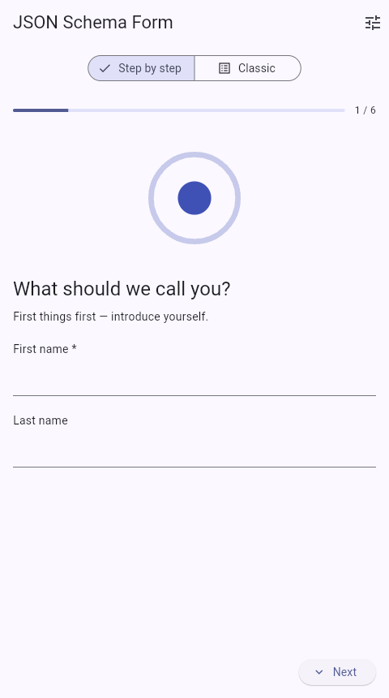
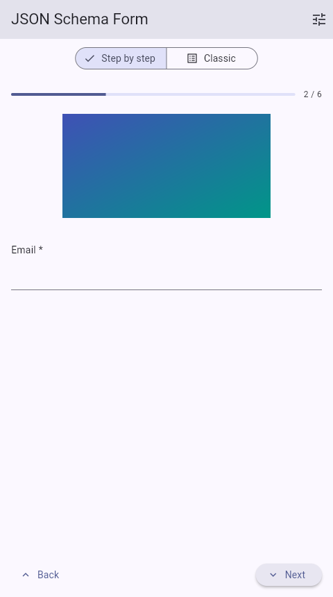
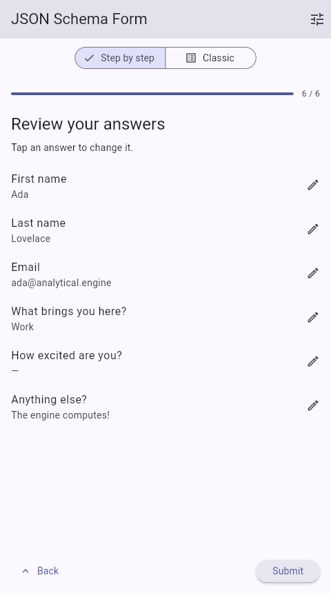

<p align="center">

  <h3 align="center">flutter_jsonschema_builder</h3>

  <p align="center">
    A simple <a href="https://flutter.dev/">Flutter</a> widget capable of using <a href="http://json-schema.org/">JSON Schema</a> to declaratively build and customize web forms.
    <br />
    Inspired by <a href="https://github.com/rjsf-team/react-jsonschema-form">react-jsonschema-form</a>
    <br />    
</p>

## Installation

Add dependency to pubspec.yaml

```
dependencies:
  ...
  flutter_jsonschema_builder: ^0.0.1+1
```

Run in your terminal

```
flutter packages get
```

See the [File Picker Installation](https://github.com/miguelpruivo/plugins_flutter_file_picker) for file fields.

## Usage

```dart
import 'package:flutter_jsonschema_builder/flutter_jsonschema_builder.dart';


final jsonSchema = {
  "title": "A registration form",
  "description": "A simple form example.",
  "type": "object",
  "required": [
    "firstName",
    "lastName"
  ],
  "properties": {
    "firstName": {
      "type": "string",
      "title": "First name",
      "default": "Chuck"
    },
    "lastName": {
      "type": "string",
      "title": "Last name"
    },
    "telephone": {
      "type": "string",
      "title": "Telephone",
      "minLength": 10
    }
  }
}


@override
Widget build(BuildContext context) {
  return Scaffold(
    body: JsonForm(
      jsonSchema: jsonSchema,
      onFormDataSaved: (data) {
        inspect(data);
      },
    ),
  );
}
```


### Using arrays & Files
```dart
  final json = '''
{
  "title": "Example 2",
  "type": "object",
  "properties": {
   "listOfStrings": {
      "type": "array",
      "title": "A list of strings",
      "items": {
        "type": "string",
        "title" : "Write your item",
        "default": "bazinga"
      }
    },
    "files": {
      "type": "array",
      "title": "Multiple files",
      "items": {
        "type": "string",
        "format": "data-url"
      }
    }
  }
}
  ''';

### Using UI Schema
```dart

final uiSchema = '''
{
  "selectYourCola": {
    "ui:widget": "radio"
  }
 }
''';

```


### Stepped display mode

`JsonForm` can walk through the form one question at a time — a
conversational, wizard-style experience — instead of rendering everything on
one page.

<p>
  
  
  
</p>

Enable it with `displayMode`:

```dart
JsonForm(
  jsonSchema: jsonSchema,
  uiSchema: uiSchema,
  displayMode: JsonFormDisplayMode.stepped,
  steppedConfig: JsonFormSteppedConfig(
    transitionAxis: Axis.vertical, // or Axis.horizontal
    showReviewStep: true,          // summary page before submitting
  ),
  onFormDataSaved: (data) => inspect(data),
)
```

The stepped mode expands to fill its parent, so give it a bounded height
(a `Scaffold` body, `Expanded`, `SizedBox`...) instead of wrapping it in a
scroll view. It shows a progress bar with a step counter, validates the
current step before advancing, and keeps entered values when navigating back.
Back/next buttons, the progress bar and all labels can be customized through
`JsonFormSteppedConfig`; the submit button reuses
`JsonFormSchemaUiConfig.submitButtonBuilder`.

#### Defining steps

Steps are derived from the structure of the JSON schema itself — a plain
schema works in both display modes without any ui schema:

* every scalar field and every array is its own step
* a nested object becomes a single step holding all its fields, and the
  object's own `title` and `description` render as the step's header — the
  same title and description classic mode shows as a section header

```json
{
  "type": "object",
  "properties": {
    "name": {
      "type": "object",
      "title": "What should we call you?",
      "description": "First things first — introduce yourself.",
      "required": ["first"],
      "properties": {
        "first": {"type": "string", "title": "First name"},
        "last": {"type": "string", "title": "Last name"}
      }
    },
    "email": {"type": "string", "title": "Email", "format": "email"}
  }
}
```

produces two steps — "What should we call you?" with both name fields, then
email — and the submitted data mirrors the schema:
`{"name": {"first": ..., "last": ...}, "email": ...}`.

#### Step media: images and Lottie animations

Each step can show an image or an animation above its fields, declared in the
ui schema with `ui:media` on a field or on a nested object:

```json
"email": {
  "ui:media": {
    "type": "image",
    "src": "https://example.com/mail.png",
    "height": 160,
    "fit": "cover"
  }
}
```

The package renders the types `image` (network url) and `asset` (bundled
asset) out of the box. Any other type is handed to
`JsonFormSteppedConfig.mediaBuilder`, so the package stays dependency-free
while apps bring their own players — e.g. Lottie:

```dart
steppedConfig: JsonFormSteppedConfig(
  mediaBuilder: (context, media) {
    if (media.type == 'lottie') {
      return Lottie.asset(media.src, height: media.height ?? 160);
    }
    return null; // fall back to the built-in image/asset rendering
  },
),
```

See `example/lib/main.dart` for a runnable demo with both modes, grouped
steps, an image step and a Lottie step.

#### Customizing the stepped mode

Customization follows the usual Flutter layering — most apps need nothing
beyond their existing theme:

1. **Ambient `Theme`** — the defaults are built from `Theme.of(context)`:
   the progress bar honors `ProgressIndicatorThemeData` and
   `ColorScheme.primary`, step titles/descriptions use
   `TextTheme.headlineSmall`/`bodyMedium`, and the navigation buttons are
   plain `ElevatedButton`/`TextButton`, so `ElevatedButtonThemeData` etc.
   apply. A themed app gets a matching stepped form with zero configuration.
2. **`JsonFormSteppedConfig`** — behavior and text: transition axis,
   duration and curve, review step, button labels, and explicit
   `stepTitleStyle`/`stepDescriptionStyle` overrides (widget style beats
   theme, as with Material widgets).
3. **Builders** — replace whole pieces when styling isn't enough:
   `progressBuilder`, `mediaBuilder`, `nextButtonBuilder`,
   `backButtonBuilder`, and the existing
   `JsonFormSchemaUiConfig.submitButtonBuilder` for the final button.

The default building blocks are exported as plain widgets —
`JsonFormStepProgress`, `JsonFormStepHeader`, `JsonFormStepMedia` — so a
builder override can compose them instead of starting from scratch:

```dart
steppedConfig: JsonFormSteppedConfig(
  progressBuilder: (context, current, total) => Padding(
    padding: const EdgeInsets.symmetric(horizontal: 32),
    child: JsonFormStepProgress(currentStep: current, totalSteps: total),
  ),
),
```

### Custom File Handler 

```dart
customFileHandler: () => {
  'profile_photo': () async {
    
    return [
      File(
          'https://cdn.mos.cms.futurecdn.net/LEkEkAKZQjXZkzadbHHsVj-970-80.jpg')
    ];
  },
  '*': null
}
```

### Initial File Value Handler

As file can be represented as any string, even a URL, so we need a way to convert back that string into an actual file value, we can provide `initialFileValueHandler` for this case

```dart
initialFileValueHandler: () => {
  'profile_photo': (dynamic defaultValue) async {
    if(defaultValue is List) 
    // fetch list of images logic here
    return;
    if(defaultValue is String){
      final file = await fetchOurFileFromUrl(defaultValue);
      return [SchemaFormFile(name: file.name, bytes: await file.readAsBytes(), value: defaultValue )]
    }
    
  },
  '*': null
}

Future<List<SchemaFormFile>?> _defaultInitialFileValueHandler(
    dynamic defaultValue) async {
  Future<SchemaFormFile?> schemaFileFromUrl(String url) async {
    // file fetching logic here
  }

  if (defaultValue is List) {
    final result =
        await Future.wait(defaultValue.cast<String>().map(schemaFileFromUrl));
    return result.whereType<SchemaFormFile>().toList();
  }

  if (defaultValue is String) {
    final file = await schemaFileFromUrl(defaultValue);
    if (file != null) return [file];
  }

  return null;
}
```

### Using Custom Validator

```dart
customValidatorHandler: () => {
  'selectYourCola': (value) {
    if (value == 0) {
      return 'Cola 0 is not allowed';
    }
  }
},
```


### TODO

- [ ] Add all examples
- [ ] OnChanged
- [ ] References
- [ ] pub.dev

